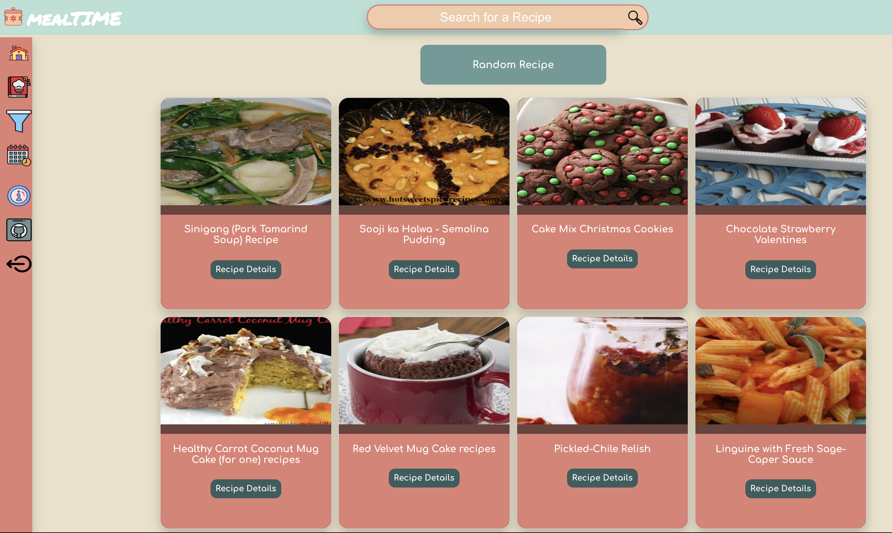
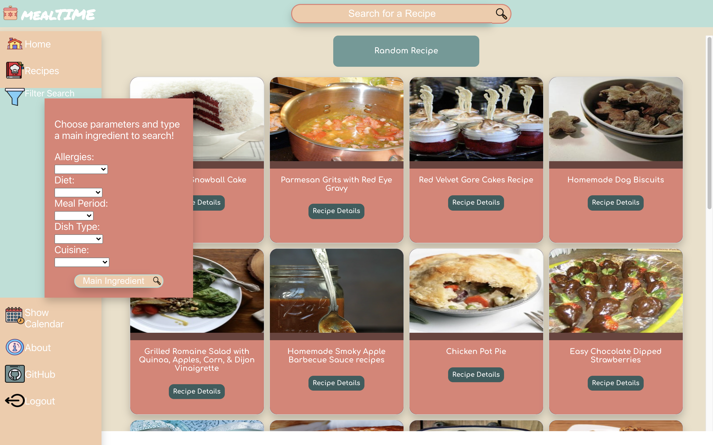
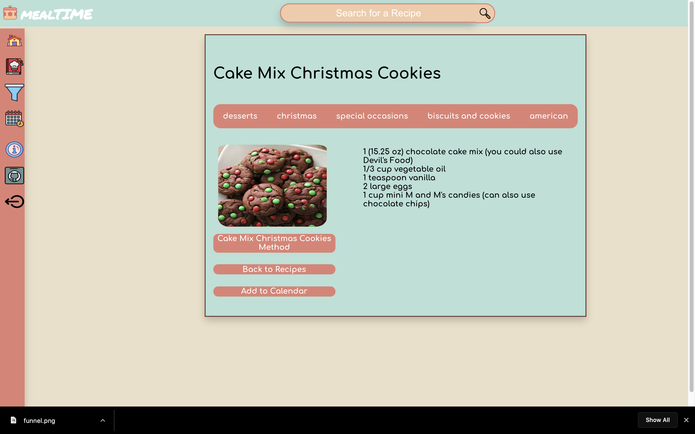

# mealTIME App

## This is an app that allows users to search through a database and find recipes. The user can generate random recipes, search based on any keyword, or refine search using a filtered search.

## [Test out the app here!](https://sei-project-mr-meal-planner.herokuapp.com/)

-----
## This app does not need to be installed
----
# User Stories
- As a user that wants to get their diet under control, I want an app helps me plan for the week ahead so that I can stay healthy.
- As a user that lives on a tight budget, I want an app that shows me all of the ingredients i need so that I don't waste any money at the store.
- As a user that never knows what to cook, I want an app that can show me new and exciting recipes that I haven't seen before so that I can mix up my routine.
- As a user that doesn't really know how to cook, I want recipes that are clear, concise, and straightforward so that I can teach myself to cook.
- As a user that appreciates what my food looks like, I want to search for recipes that have beautiful pictures so that I can have a clear idea of what the dish should look like.
----
# Screenshots

**Home Page**


**Side Bar**


**Recipe Detail Card**



# Functionality / Technologies Used

**The main functionality of this app is to fetch data from a third-party API and render it on screen for users.**

Code snippet of API call:

This is an example of how the app makes calls to the API and handles the data for the keyword search.

The `handleChange` function recognizes the value that is put into the search bar, and sets the url (using `setCurrentUrl`) to `url` + `searchString`. This allows the user to type any keyword, ingredient, recipe tag, recipe name, etc. and receive results from the API. The `handleSubmit` function utilizes the `getRecipes` function to actually make the fetch call. Then it sets the value of `searchString` back to empty. Lastly, when the form is submitted, it renders the Recipe component via `useHistory`.

```js
 const APIInfo = {
        key: process.env.REACT_APP_API_KEY,
        id: process.env.REACT_APP_API_APP_ID,
    }
    const { searchString, setSearchString } = useContext(DataContext)
    let url = `https://api.edamam.com/api/recipes/v2?type=public&app_id=${APIInfo.id}&app_key=${APIInfo.key}`
    
    const { setRecipes } = useContext(DataContext)
    const [currentURL, setCurrentURL] = useState(url)
    const history = useHistory()
    
    function handleSubmit(event) {
        event.preventDefault()
        getRecipes()
        setSearchString("")
        history.push('/recipes')
    }

    function handleChange(event) {
        setSearchString(event.target.value)
        setCurrentURL(url.concat(`&q=${event.target.value}`))
    }
    

    useEffect(() => {getRecipes()},[]);
   
    
    function getRecipes()  {
            fetch(currentURL).then(res => res.json()).then(res => {setRecipes(res.hits)}).catch(console.error)
        }
```

Technologies used:

- Built using React.js
- Designed using flexbox and CSS grid
- Utilizes Route and Links via react-router-dom.
- useState, useEffect, useContext, and useHistory

Example data response:
```js
"recipe":{18 items
"uri":"http://www.edamam.com/ontologies/edamam.owl#recipe_b79327d05b8e5b838ad6cfd9576b30b6"
"label":"Chicken Vesuvio"
"image":"https://www.edamam.com/web-img/e42/e42f9119813e890af34c259785ae1cfb.jpg"
"source":"Serious Eats"
"url":"http://www.seriouseats.com/recipes/2011/12/chicken-vesuvio-recipe.html"
"shareAs":"http://www.edamam.com/recipe/chicken-vesuvio-b79327d05b8e5b838ad6cfd9576b30b6/chicken"
"yield":4
"dietLabels":[...]1 item
"healthLabels":[...]2 items
"cautions":[...]1 item
"ingredientLines":[...]10 items
"ingredients":[...]11 items
"calories":4228.043058200812
"totalWeight":2976.8664549004047
"totalTime":60
"totalNutrients":{...}32 items
"totalDaily":{...}25 items
"digest":[...]26 items
```
-----
# WireFrames

**This is the mockup for the Login page**


**About Page**


**Home Page**


**Recipe Card**


-----
# Stretch Goals / Major Hurdles / Work in Progress

Stretch goals:
- being able to add recipes to the site
- better styling
- improved functionality of search
- frequently used, or last used recipe
- button to mark days on the calendar as "going out"
- add meal periods to the calendar

Major Hurdles:

I have spent most of my time on this project figuring out how to set the filter parameters for the search function. The other major hurdle I have faced during this project is being able to add recipes to the Calendar.

Work in Progress:

- Calendar Functionality
- Improved Search Parameters
- Refactoring code for efficiency

----
# Resources

- [W3C](https://www.w3.org/)
- [Stack Overflow](https://stackoverflow.com/)
- [CSS Tricks](https://css-tricks.com/)
- [Edamam Recipe Search API](https://developer.edamam.com/edamam-docs-recipe-api)